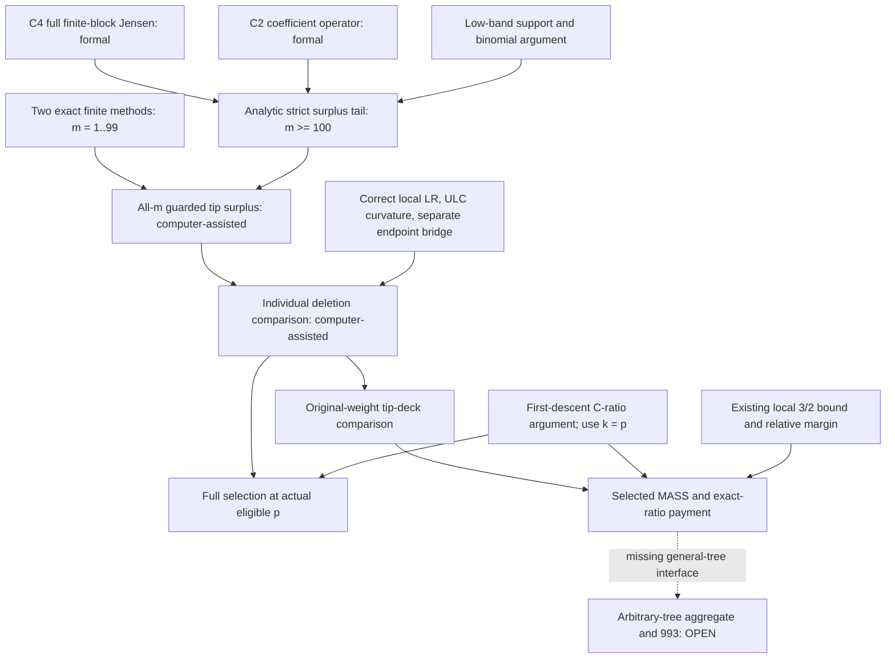

# Astra final analysis — six-cycle absolute compensation experiment

Final independent mathematical review accepted; the governed tail outcome is recorded below. This text is the controller's analysis, not a component receipt or a new mathematical award. Code mathematical intake remains frozen at r30; later sibling work has not been silently incorporated.

## What the six cycles changed

The initial question asked how selected tip mass pays the residual binomial deficit at every eligible lower-half rank of ordinary path-stars with branch arities2,3,4. Cycles1–3 established all-m selection, the branchwise3/2 bound, selected MASS and exact-ratio payment at computer-assisted/nonformal grade. Those results already disposed of the selected payment problem in this restricted family. Cycles4–6 asked for a stronger mechanism that might be reusable outside it.

The resulting chain is quantitative and local to the marked coefficients: full finite-block Jensen amplification bounds the literal marked product; the coefficient derivative operator controls the adverse binomial minor; enlarged-order ULC curvature and the correctly matched adjacent-ratio order convert surplus into a shifted comparison for each deletion. The endpoint needs its own main-product comparison, even though coefficient dominance lets a tip surplus pay its common deficit. Original-multiplicity summation then gives the weighted comparison against the same C.

The accepted C6 conclusion covers every nonempty mixed or repeated arity2/3/4 profile and every natural k>=1 with2k<=N+2. It does not impose actual descent or selector eligibility. Both complete finite instruments check m1..99 (171699 count profiles,56245000 represented-type/rank tests each), with strictly positive minimum98. The analytic proof covers allm>=100. The overlap is exact: there is no untested gap and no extension of finite evidence by induction without proof. The resulting all-m evidence grade is computer-assisted/nonformal, even though the exact analytic tail now has its own Lean award.

Three pre-existing OPEN identities are accepted at VERIFIED computer-assisted/nonformal grade: exact-ratio tip surplus, individual guarded shifted-C deletion comparison, and original-multiplicity weighted-tip-deck comparison. No new threshold, census-implementation, scalar-arithmetic or conditional-corollary identities are needed merely to increase registry counts. The independent review checked all515identities and rejected duplicate registrations; the controller accepted its three proposed upgrades.

## Why this is meaningful progress

The stronger comparison explains the earlier observed full selection. With the contract's forward difference Delta_p A=A[p+1]-A[p], apply the comparison at k=p. Actual first descent of P=C+z(1+z)^(N+1), the rising binomial component there, and positive log-concavity of C imply C[p]/C[p-1]<1 under all the eligible-rank guards. The comparison gives A_v[p+1]/A_v[p]<=C[p]/C[p-1]<1 for every original leaf. This is a structural implication; it does not assume the selected aggregate to prove its individual terms.

The weaker weighted comparison is enough for the payment route when combined with the separately accepted local3/2 bound: strict descent of the weighted deck forces some selected branch with original tip weight at least2, which pays the possible endpoint contribution. This separates the necessary payment mechanism from the stronger all-leaf selection theorem and gives two distinct interfaces to test in future families.

The reusable formal infrastructure is also substantive: C2's coefficient operator/rank control, C3's center-subset expansion and C4's complete finite-block Jensen theorem have governed awards. The Jensen theorem uses the actual uniform labeled-subset law, including the joint dependence, size-one blocks and empty-family/boundary cases. It is not an independence heuristic or an assigned count-vector probability.

## Proof dependencies and the remaining boundary

The exact formal status of the tail is stated in the final formal-outcome section. Neither that status nor the C4 award removes the finite-prefix and downstream proof obligations from the all-m formal chain. The dotted edge denotes a missing implication, not an available reduction.

## What failed, and what must not be repeated

The E-only minor can be negative while the full deletion comparison is positive. Coarse lower bounds can fail while exact surplus is positive. A negative activity coefficient can refute a coefficientwise proof mechanism without refuting its value at activity1. The C5 arity4 activity obstruction is universal for its specified deformation; the evaluated full and weighted minors remain positive at the witness. These are useful constraints on future methods, not counterexamples to the central claim.

Review exposed concrete proof errors: the wrong local pair (F_r,B_r) was used for a product containing B_(r-1); the low-band second bracket needs binomial log-concavity in addition to normalized rise; the singleton excess is1, with the arity factor coming from the marginal count; and the selector application must use k=p rather than p-1. The false prose equivalence in the deficit bound is replaced by the exact positive difference3/(2(N+2-k)). Original reports and corrected arguments are both retained. Reviewer agreement is not treated as proof.

Computation also required repair. Original A omitted invocation-level controls; the whole frozen computation was rerun with those controls and unchanged mathematical loops. B's narrow validator did not itself enforce every strictness/hash/unique-layer condition; the independent comparison checked the actual sources, all99distinct layers and strictly positive minima. A's corrected replay remains method A, not a third independent method. Matching layer summaries must not be described as stored pairwise equality of every coefficient from56million tests.

## Distance from Erdős993

This is a completed restricted-family investigation, not a reduction of arbitrary trees to that family. The arbitrary-tree aggregate, governed residual-tree interface, weighted Hall/cover mechanisms, representation/transfer chain and forest closure retain their own open obligations. The number of VERIFIED registry rows is not a percentage of a proof. A restricted-family theorem can be a strong model of the needed mechanism without removing the main global obstruction.

The correct assessment is therefore: a more credible coefficient-compensation mechanism and fewer unresolved claims inside the test family; no justified claim that a complete proof of993 is close. The next substantial step must cross a family or representation boundary, or remove a genuine dependence from the global route.

## Three priorities for maximal impact

1. **Prove a compositional marked compensation interface.** Start from exact rooted product/sum recurrences and preserve the marked deletion, rank guard and original multiplicities. Determine which child-level data bound the negative binomial/common term after a root is attached. The key question is whether compensation can be transported through composition, not whether a positive unmarked polynomial remains log-concave. A useful first test is allowing a controlled unbounded arity or one non-star rooted child. Uniform singleton amplification1/20 is specific to arities2,3,4 and does not automatically survive that change. A promising research question is whether actual deficit and Jensen occupancy can be bounded jointly, avoiding a worst-case deficit bound when amplification is weak. This is a proposed direction, not a new proved claim or authorization for another cycle.

A concrete interface for priority1 is the standard rooted independence-polynomial pair. If a child subtree has root-excluded polynomial A_i and root-included-without-the-root-weight polynomial B_i, its full polynomial is A_i+zB_i. At the new root the pair is (product_i(A_i+zB_i), product_i A_i). A leaf marked away from one child's root changes that child's pair; the other factors remain common. Deleting a child that is itself a leaf is a separate boundary case. These identities only specify the objects. The open task is to find a quantitative marked inequality preserved by this product/sum operation together with the actual rank and selection conditions. Begin with one non-star child among the existing bounded-arity children, rather than assuming closure for arbitrary pairs. This is a successor design, not a new theorem or a launched experiment.

2. **Connect Code's Hall/cover progress to the actual selected aggregate.** Preserve the r30 findings and its named unresolved capacity-sharing and parent-descent obligations. A rankwise matching theorem with the wrong marked multiplicities, residual class, or rank is insufficient. The useful interface is a capacity or charging statement for the actual eligible residual objects which can pay the same deficit appearing in the aggregate. The analytic compensation theorem and the Hall technology should meet through one explicit common inequality; merely having two successful restricted experiments is not a bridge.

3. **Turn the restricted proof into a compact, reusable formal chain.** Reuse the now-formal analytic tail and decide between formal finite reflection for m1..99 and a uniform structural proof replacing the finite prefix. Separately formalize the corrected local LR/ULC/endpoint and actual-forward-selector bridges. This improves trust and reuse, but it should not displace priority1 merely to accumulate small formal awards. The all-m global keys keep nonformal grade until their entire dependence, including the finite prefix or its replacement, is governed.

## Actual final formal outcome

The actual governed workflow closed as `formally_verified` on 29 September 2026. Kernel verification and fresh independent semantic fidelity review both passed. The theorem `e993_guarded_tip_surplus_tail` proves strict tip surplus for every mixed or repeated profile with m >= 100, each branch arity in {2,3,4}, every marked branch, and every natural k >= 1 with 2k <= N+2. It uses the six literal real-polynomial definitions and has no extra ULC, LR, selector, or finite-prefix premise.

The package contains 138 registered declarations: 22 definitions, 115 lemmas, and one terminal theorem. Forty-two Jensen declarations are reused with checked provenance; the real-polynomial operator and center bridges are reproved. The elaborated terminal type was checked. Only `propext`, `Classical.choice`, and `Quot.sound` occur in the reported axioms.

The Lean source SHA-256 is `5cb8504d9461fec67f54f045c184c34d4896c14b8fa0e62ce1effcefaf433bfc`; the contract SHA-256 is `01cdacd246c3f41d099eba4e7b88ecd72c8442ca20f1cf7ff4940a0f0771699d`; the expected statement SHA-256 is `4dd33af0ac00b5ff9b9421bf9910116355b29019fa3652755c220c0e6da2cd82`. The independent review attestation is `c6-tail-fidelity-a6dffc7a-953d-471a-a0c3-e493a33ff4be`. Fidelity recorded 34 passed checks, zero failed checks, and one explicit scope warning.

This award is restricted to the analytic tail. The finite prefix m=1..99 and downstream endpoint, LR/ULC, selector, MASS and payment arguments do not acquire a formal award from this result. The three all-m registry claims remain computer-assisted/nonformal. Erdős 993 and the arbitrary-tree aggregate remain OPEN.

The workflow used zero of its two governed repair attempts. Development diagnostics, the rejected initial local-checkout dependency setup, the repaired informal deficit-bound equivalence, and the producer report's truncated historical source hash are preserved with their actual corrections; none is erased or reclassified as a successful initial attempt. See the actual verification report, receipts, provenance note, and independent review in the tail run.

## Stop and handoff

Six cycles are the authorized limit. No seventh cycle is opened. Terminal documentation must state the actual outcome of the separate tail formal attempt, distinguish registered mathematical statuses from formal awards, and preserve all remaining global obligations. Future work should be proposed around the three priorities above, with a new exact contract and a disjoint scope from Code.
