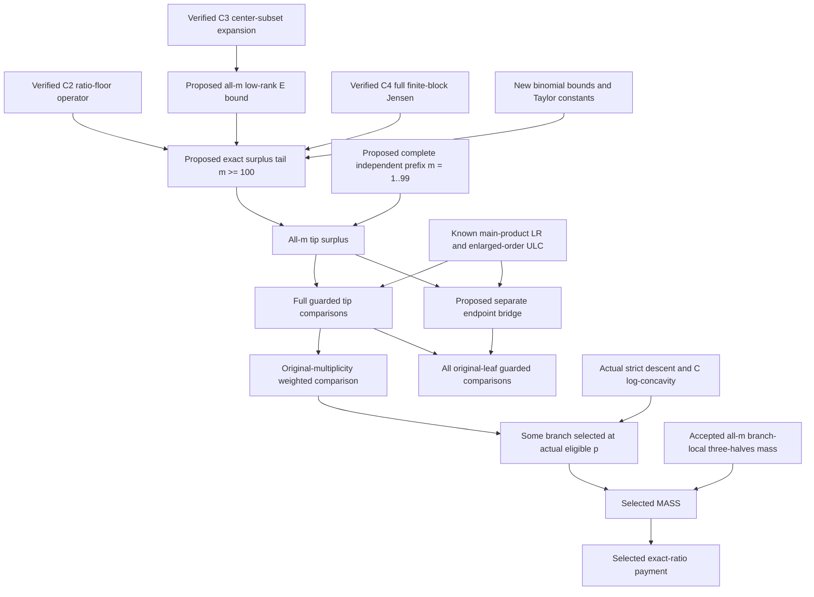

# Proposed proof dependency map, pending C5/C6 review

Every node is scoped to the stated arity2/3/4 ordinary path-star family. This map adds no proof, formal award, arbitrary-tree theorem or status update.

Endpoint treatment is needed for the stronger ALL-original-leaf individual comparison. It is NOT needed for the weaker weighted-tip comparison or its primary payment application: all tip comparisons sum against the SAME C with positive original r_i. At actual eligible p, C[p]/C[p-1]<1 then forces W[p+1]<W[p], so at least one branch has a strict current-p deletion descent. Its total selected original tip multiplicity R is>=2. The accepted branch-local3/2 inequality gives A>=3R delta D/2>=(R+e0)delta D because e0<=1. This is the selected MASS bridge; the known favorable C slope then yields the registered exact-ratio payment. Each guard, positivity and exact index must still be checked independently.

Thus an endpoint-bridge problem should not falsely block the weaker sufficient route. Conversely, an already accepted family payment does not imply the stronger all-guard comparison or surplus predicates. A successful complete prefix plus formal tail would still be computer-assisted at all-m scope, and the main-LR/ULC conversion retains its separate evidence grade. No finite prefix may be silently turned into a universal Lean theorem. The arbitrary-tree lower aggregate and governed representation/forest obligations remain outside this map.
